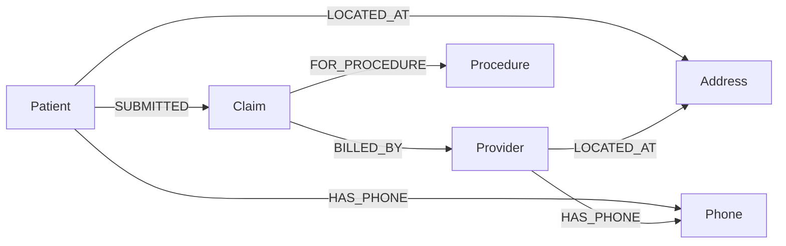
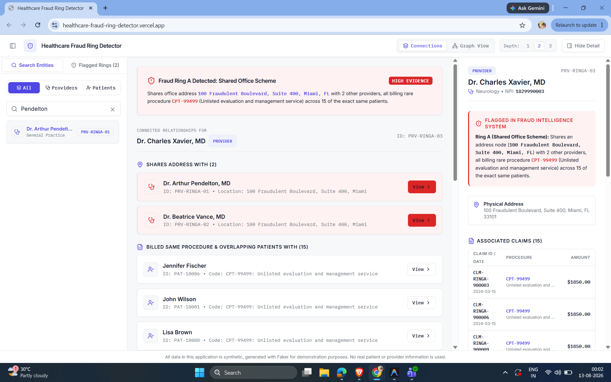
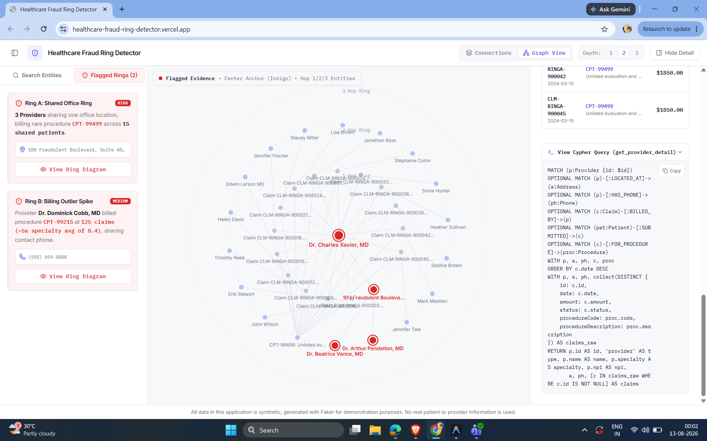
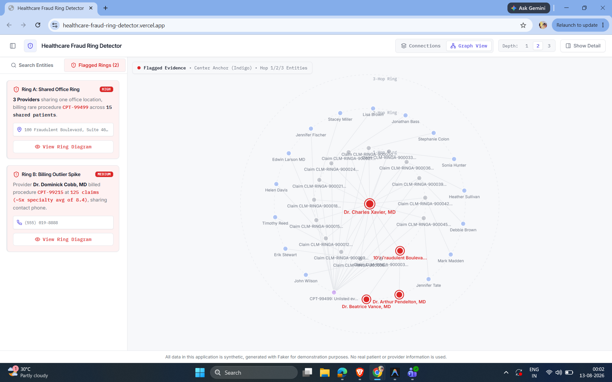
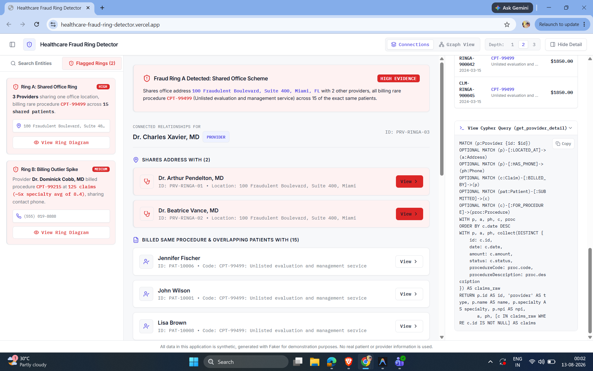
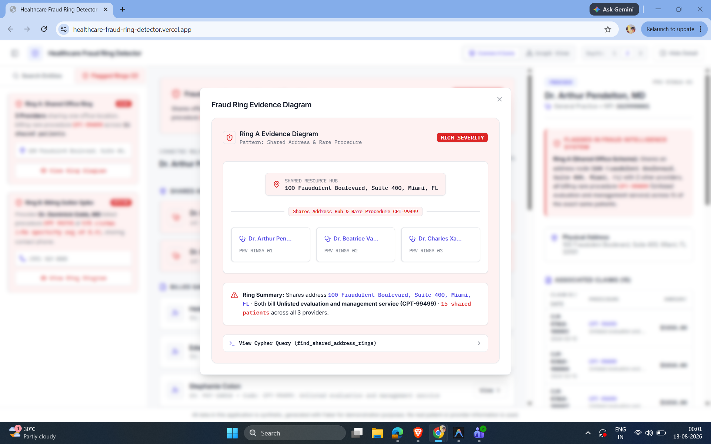
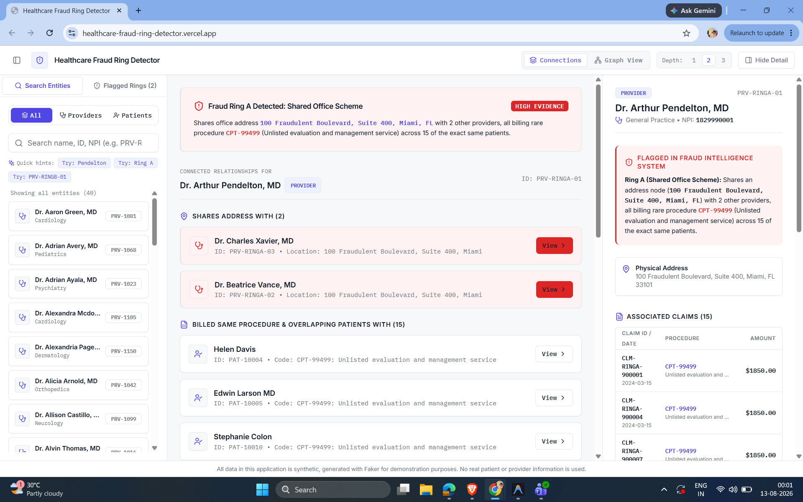

# Healthcare Fraud Ring Detector

**A graph-native investigation tool for surfacing healthcare fraud rings — built on CognoDB, Django, and React.**

> ⚠️ **All data in this application is synthetic**, generated with [Faker](https://faker.readthedocs.io/) for demonstration purposes. No real patient, provider, or claims information is used anywhere in this project.

🔗 **Live demo:** https://healthcare-fraud-ring-detector.vercel.app/

🔧 **Backend API:** https://healthcare-fraud-ring-detector.onrender.com/

📦 **Repository:** https://github.com/Rishabh987654321/Healthcare-Fraud-Ring-Detector

🎥 **Demo:** See the product walkthrough below.
## Demo


---

## Table of contents

* [The use case](#the-use-case)
* [Why a graph database?](#why-a-graph-database)
* [Data model](#data-model)
* [Architecture](#architecture)
* [Tech stack](#tech-stack)
* [Setup & running locally](#setup--running-locally)
* [Core queries, explained](#core-queries-explained)
* [Screenshots](#screenshots)
* [Testing](#testing)
* [Limitations & future work](#limitations--future-work)
* [Project structure](#project-structure)

---

## The use case

Health insurers lose billions of dollars a year to fraud rings — small clusters
of providers and patients who coordinate to bill for unnecessary or fabricated
procedures. These schemes are rarely visible from a single claim in isolation;
they only become obvious once you look at the *relationships* between claims:
providers who mysteriously share an office address, phone numbers that show up
across supposedly unrelated practices, or a doctor billing a rare procedure at
five times the rate of anyone else in their specialty.

This app lets an investigator search any provider or patient and immediately see:

* Who they're suspiciously connected to, and *why* (shared address, shared
  phone, overlapping billing patterns) — explained in plain language, not raw
  query output.
* A list of all currently detected fraud rings, each with a plain-English
  summary and a small, curated diagram of just that ring.
* Full claim history for any entity, for manual review.

## Why a graph database?

Fraud rings are defined by **relationships**, not attributes. The question that
actually matters — *"which providers are secretly connected, and through what
chain of evidence?"* — is a multi-hop pattern match. In a graph, that's a native
traversal. In a relational schema, it's a cascading series of self-joins that
gets structurally worse every time you add a new kind of connection to check.

Concretely, in this project:

* **Finding a ring** (`Provider`s sharing an `Address`, billing the same
  `Procedure`, across overlapping `Patient`s) is a single 4-hop Cypher pattern.
  The equivalent in SQL is a chain of self-joins across a providers table, an
  addresses table, a claims table, and a procedures table — and it only grows
  messier as more connection types (shared phone, shared bank account, shared
  billing agent) get added later, since each one is another join, another
  index, another query to hand-maintain.
* **"Who is connected to this flagged provider within 3 hops, through *any*
  combination of shared address or shared phone?"** — a genuinely awkward
  question in SQL, requiring a recursive CTE with manual cycle-guarding and a
  UNION across two join conditions. In Cypher, it's one variable-length
  relationship pattern: `-[:LOCATED_AT|HAS_PHONE*1..3]-`. Extending it to a
  third connection type later is a one-token change, not a rewrite.
* This asymmetry — Cypher complexity staying roughly flat as the model grows,
  SQL complexity growing combinatorially — is the concrete argument for why a
  graph database earns its place here, rather than being a stylistic choice.

## Data model



| Node        | Key properties                        |
| ----------- | ------------------------------------- |
| `Patient`   | `id`, `name`, `dob`                   |
| `Provider`  | `id`, `name`, `npi`, `specialty`      |
| `Claim`     | `id`, `date`, `amount`, `status`      |
| `Procedure` | `code`, `description`, `typical_cost` |
| `Address`   | `id`, `line1`, `city`, `state`, `zip` |
| `Phone`     | `id`, `number`                        |

`Address` and `Phone` are modeled as **first-class nodes**, not string properties
on `Patient`/`Provider`. This is the deliberate modeling decision that makes
"who shares contact info with whom" a one-hop traversal instead of a grouped
self-join — see [Why a graph database?](#why-a-graph-database) above.

Uniqueness constraints are enforced on `Patient.id`, `Provider.id`, `Claim.id`,
and `Procedure.code`.

## Architecture

```text
┌────────────┐      REST/JSON       ┌──────────────┐     Bolt (Cypher)    ┌─────────┐
│  React SPA │ ───────────────────► │ Django + DRF │ ───────────────────► │ CognoDB │
│ (shadcn/   │ ◄─────────────────── │  (graph/     │ ◄─────────────────── │ (cloud) │
│  Tailwind) │                      │  service     │                      └─────────┘
└────────────┘                      │  layer)      │
                                     └──────────────┘
```

### Production deployment

* **Frontend:** Vercel

  * https://healthcare-fraud-ring-detector.vercel.app/
* **Backend:** Render

  * https://healthcare-fraud-ring-detector.onrender.com/
* **Database:** CognoDB Cloud

The frontend never talks to CognoDB directly — every request goes through the
Django API. All Cypher lives in `backend/graph/queries.py`, called by a thin
service layer (`backend/graph/services.py`); views stay thin and never embed
Cypher inline. Every query is parameterized through the official Neo4j Python
driver — no string-concatenated Cypher anywhere in the codebase.

## Tech stack

| Layer     | Choice                                                               |
| --------- | -------------------------------------------------------------------- |
| Database  | CognoDB (Neo4j-compatible, Bolt 5.x), official `neo4j` Python driver |
| Backend   | Python, Django, Django REST Framework                                |
| Frontend  | React, shadcn/ui, Tailwind CSS, Vite                                 |
| Seed data | Faker                                                                |
| Hosting   | Vercel (frontend) + Render (backend) + CognoDB Cloud (database)      |

## Setup & running locally

### 1. Create your own CognoDB instance

1. Sign up at [console.cognodb.com/signup](https://console.cognodb.com/signup) —
   free tier, no credit card required.
2. Create a free (`c0`) instance and pick a region — provisions in under a
   minute.
3. Copy the connection URI (`bolt+s://<instance-id>.databases.cognodb.cloud`)
   and the generated password for user `cognodb` — **the password is shown only
   once**, save it immediately.

### 2. Backend

```bash
cd backend
python -m venv venv && source venv/bin/activate   # Windows: venv\Scripts\activate
pip install -r requirements.txt

cp .env.example .env
# Edit .env and fill in:
#   COGNODB_URI=bolt+s://<instance-id>.databases.cognodb.cloud
#   COGNODB_USER=cognodb
#   COGNODB_PASSWORD=<your generated password>
#   DJANGO_SECRET_KEY=<any random string>
#   DEBUG=True

python seed/seed_data.py        # creates constraints, seeds data, plants 2 fraud rings
python manage.py runserver      # serves the API at http://localhost:8000
```

### 3. Frontend

```bash
cd frontend
npm install

cp .env.example .env
# VITE_API_BASE_URL=http://localhost:8000/api

npm run dev                     # serves the app at http://localhost:5173
```

### 4. Verify it's working

Visit `http://localhost:5173`, use the "Flagged Rings" tab to confirm both
seeded rings appear, or search "Pendelton" to jump straight to a flagged
provider.

For the deployed version, visit:

https://healthcare-fraud-ring-detector.vercel.app/

## Core queries, explained

All three below are parameterized in the actual code — inline literals here are
for readability only. Full text lives in `backend/graph/queries.py`, and the
app itself has an **"View Cypher"** toggle in the entity detail panel and ring
cards that shows the exact query behind whatever you're currently looking at.

**1. Multi-hop fraud pattern** (`find_shared_address_rings`) — providers sharing
an address, billing the same rare procedure, across overlapping patients. A
4-hop traversal: `Provider → Address → Provider → Claim → Procedure`, joined
through shared patients. This is the query that finds Ring A in the seed data.

**2. Variable-length traversal** (`get_entity_network`) — everything within 1-3
hops of a selected entity, via *either* shared address or shared phone, at any
depth: `-[:LOCATED_AT|HAS_PHONE*1..N]-`. This is the query a relational schema
would genuinely struggle with — the SQL equivalent needs a recursive CTE with a
UNION across two join conditions and manual cycle-guarding, and gets messier
every time a new connection type is added. In Cypher, adding a third
relationship type to check is a one-token change to the pattern.

**3. Outlier billing ranking** (`find_billing_outlier_rings`) — providers
billing a procedure at 3.5x+ their specialty's average rate, cross-checked
against shared Phone nodes. This is the query that finds Ring B in the seed
data.

## Screenshots

| | |
|---|---|
|  |  |
| Browsing/searching entities | Grouped connection evidence |
|  |  |
| Curated ring diagram | Cypher query behind the detection |
|  |  |
| Evidence supporting the detected fraud ring | Detailed information for a flagged provider |

## Testing

```bash
cd backend
python manage.py test graph
```

**Test result: 4 passing / 4 total**

```text
Found 4 test(s).
....
----------------------------------------------------------------------
Ran 4 tests in 7.355s

OK
```

These are integration tests run against the live seeded CognoDB instance
(confirming the health check, both planted fraud rings, and entity search all
resolve correctly) rather than isolated unit tests — an intentional trade-off
given the project's time constraints.

## Limitations & future work

* Fraud-ring detection thresholds (patient overlap count, billing-rate
  multiplier) are hardcoded constants tuned for this seed dataset, not
  configurable — a production version would expose these as tunable rules with
  a review/approval workflow rather than an automatic flag.
* Detection currently covers two specific patterns (shared address + rare
  procedure, and billing-rate outliers). Real fraud detection would combine
  many more signals (claim timing patterns, upcoding, patient identity
  verification) and likely a scoring model rather than binary rules.
* The free CognoDB tier's size limits mean the seed dataset (~2,000 patients,
  ~155 providers, ~6,200 claims) is a small illustrative sample, not
  production scale.
* Authentication and authorization: The current version does not include authentication or authorization. As a future enhancement, the system should implement role-based access control (RBAC) to ensure that only authorized investigators can access sensitive patient and provider data.

## Project structure

```text
backend/
├── config/              # Django settings, env loading
├── graph/               # All CognoDB interaction — connection, queries, services, views
├── seed/                 # Faker-based seed script, plants 2 fraud rings
└── requirements.txt

frontend/
├── src/
│   ├── components/
│   │   ├── ui/            # shadcn/ui primitives
│   │   ├── connections/   # ConnectionsPanel, evidence cards
│   │   ├── graph/          # GraphCanvas (radial/ego layout)
│   │   ├── rings/          # RingDiagram
│   │   ├── search/         # SearchBar, FilterPanel, FraudRingsList
│   │   └── detail/         # EntityDetailPanel
│   ├── lib/                # Typed API client, Cypher reference snippets
│   └── App.tsx
└── package.json
```
